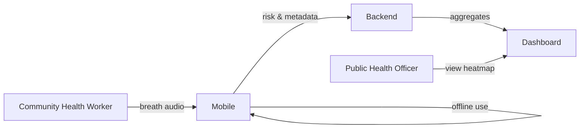
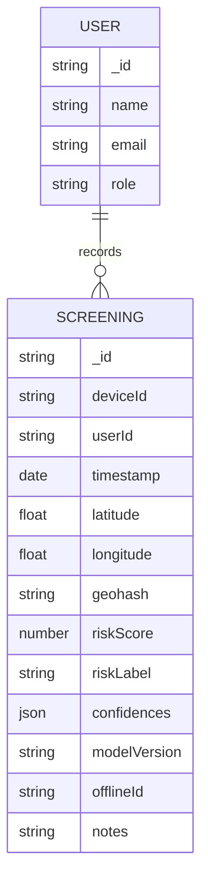
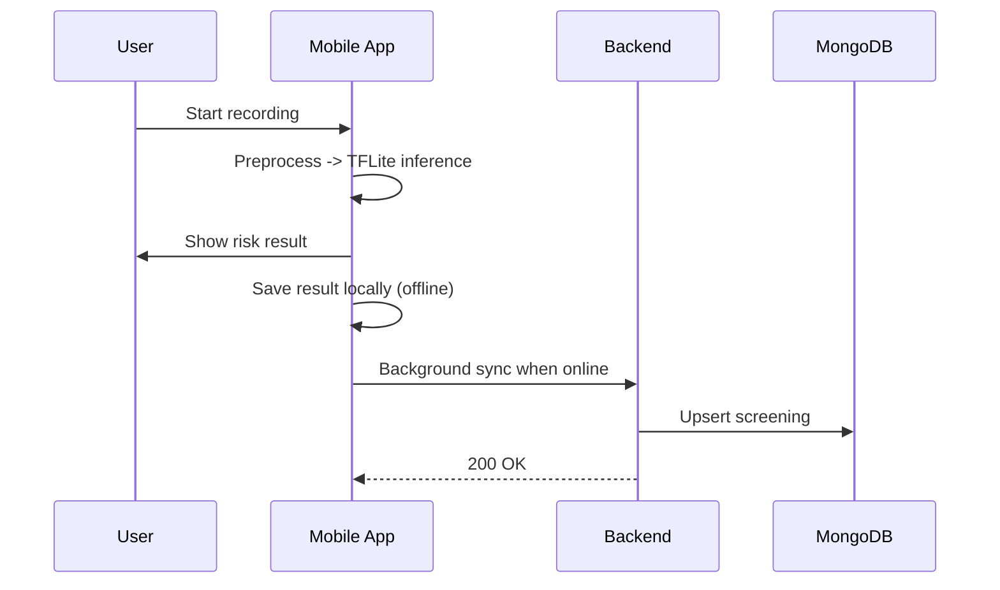
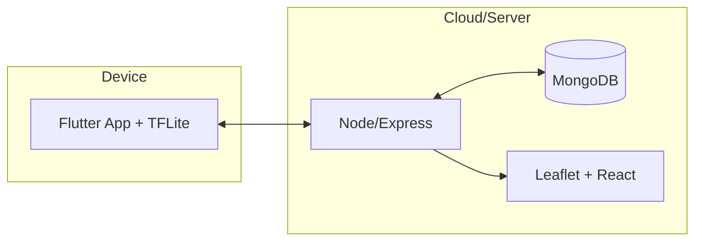

# Architecture & Diagrams

## High-Level Components
- Mobile app (Flutter): audio capture, on-device TFLite inference, offline cache, background sync
- Backend (Node/Express + MongoDB): REST APIs, aggregation, dashboard hosting
- Dashboard (Leaflet): heatmap and analytics
- ML Pipeline (Python): training, evaluation, TFLite export
- Hardware: 3D-printed funnel improving SNR and hygiene

## Context Diagram (DFD Level 0)


## DFD Level 1: Mobile and Backend Flows
```mermaid
flowchart TB
  subgraph Mobile
    A[Record Breath Audio] --> B[Preprocess (normalize, pad)]
    B --> C[TFLite Inference]
    C --> D[Display Risk]
    D --> E[Store Locally (Hive)]
    E --> F[Sync Service]
  end

  subgraph Backend
    G[POST /api/screenings] --> H[MongoDB Save]
    I[GET /api/screenings/aggregate] --> J[Geo Aggregation]
    J --> K[Return Geohash Buckets]
  end

  F -- online --> G
  G --> I
```

## ERD (MongoDB schema)


## Use Cases (key)
- Record breath and pre-screen offline
- View on-device risk score
- Sync when online
- View public health heatmap

## Sequence: Offline first then sync


## Deployment View
